---

# 🌍✨ Ruby Poddar Data Explorer 

<p align="center">
  
</p>

<p align="center">
  
</p>

---

## 😭 About Me 

Hi, I am **Ruby** 👋

I don’t know what I am…
but I am **everything a little bit** 😭

* 🤖 Data Scientist
* ✍️ Writer & Poet
* 🎸 Guitarist + Singer
* 🍳 MasterChef (self-declared 😌)
* 🧠 Government job aspirant
* 🌍 Explorer of literally everything

> “Jack of all trades… master of confusion 😭✨”

---

## 🧠 What I Do 
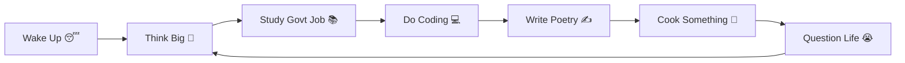

👉 I explore data
👉 I explore life
👉 I explore myself
👉 Sometimes… I explore fridge also 🍕

---

## 🛠️ Skills

| Category     | Skills                      |
| ------------ | --------------------------- |
| 💻 Tech      | Python, SQL, ML, DL         |
| 📊 Data      | Pandas, NumPy               |
| 📈 Viz       | Matplotlib, Seaborn         |
| 🤖 AI        | TensorFlow, PyTorch         |
| 🧠 Brain     | Overthinking                |
| 🍳 Cooking   | Maggi → MasterChef Level 😌 |
| 🎸 Music     | Guitar + Singing            |
| ✍️ Writing   | Poetry + Stories            |
| 📚 Govt Prep | Yes… trying my best 😭      |

---

## 🚀 Projects 

* Titanic Prediction 🚢
* Loan Approval 💰
* Fraud Detection 🚨
* NLP Text Analyzer 💬
* Image Classification 🖼️

> “Kabhi model sahi… kabhi main sahi 😌”

---

## 📊 GitHub Stats 
<p align="center">
  
</p>

<p align="center">
  
</p>

---


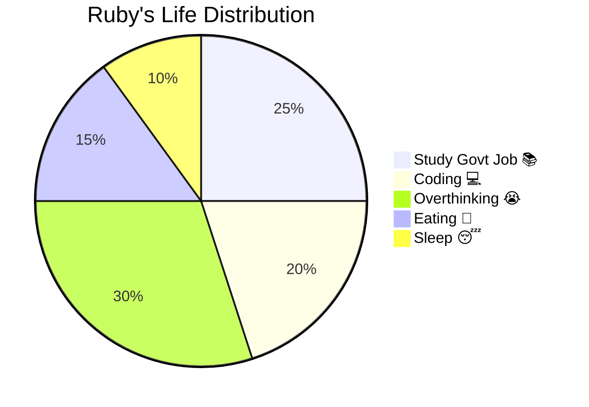

---

## 📈 Contribution Graph 

<p align="center">
  
</p>

---

## 🧊 Snake is eating my hardwork 😭

<p align="center">
  
</p>

---

## 🧩 My Coding Journey (100% Honest 😭)

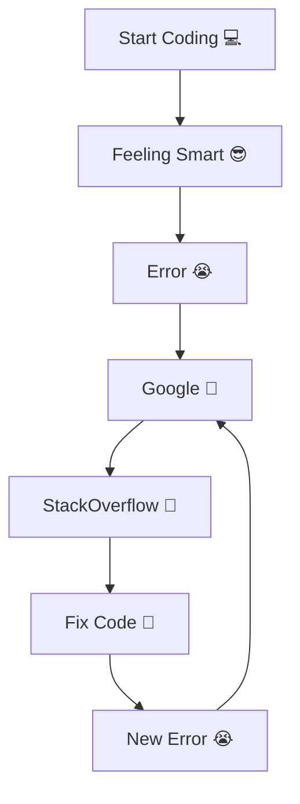

---

## 🏆 Self Respect Matters 😌

* Survived Python errors 😭
* Completed ML projects 😎
* Teaching others 💡
* Still not giving up 🔥

---

## 📬 Contact Me 

<table>
<tr><td>👩 Name</td><td>Ruby Poddar</td></tr>
<tr><td>📧 Email</td><td>rubypoddarr@gmail.com</td></tr>
<tr><td>📱 Phone</td><td>+91 8745002077</td></tr>
<tr><td>📍 Location</td><td>New Delhi, India 🇮🇳</td></tr>
<tr><td>💻 GitHub</td><td><a href="https://github.com/rubypoddarr">rubypoddarr</a></td></tr>
</table>

---

## 🌱 Current Mission

* Crack Government Job 💼
* Become Strong Data Scientist 🤖
* Learn Everything Possible 🌍
* Stay Happy 😌

---

## ☕ Final Truth 
Sometimes I feel:

* I can do everything 😎
* Then I open one bug… and life becomes philosophical 😭

---

<p align="center">
  
</p>

> “Life is not perfect…
> Code is not perfect…
> But chai is always perfect ☕😌”

---

```
When code works on first try:
Me: "I am genius 😎"

When code gives error:
Me: "Who wrote this useless code?? 😡"

Also me: wrote it 2 minutes ago 😭
```

---

# 🧠 Brain vs Reality

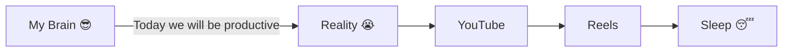

---


| Time  | Activity                             |
| ----- | ------------------------------------ |
| 6 AM  | Wake up with motivation 😤           |
| 7 AM  | Back to sleep 😴                     |
| 10 AM | Start studying 📚                    |
| 11 AM | Check phone 📱                       |
| 1 PM  | Eat food 🍛                          |
| 2 PM  | “Just 5 min rest” → 2 hours sleep 😭 |
| 5 PM  | Coding 💻                            |
| 7 PM  | Question life 🤔                     |
| 11 PM | “Kal se pakka serious” 😌            |

---

# 🧪 My Mood Graph 

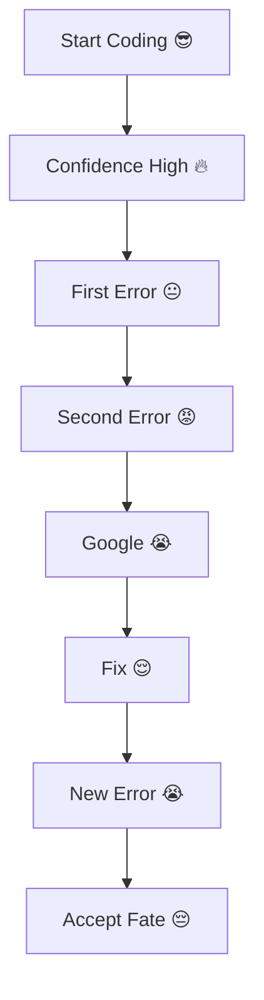

---

# 🧬 My Skill Evolution

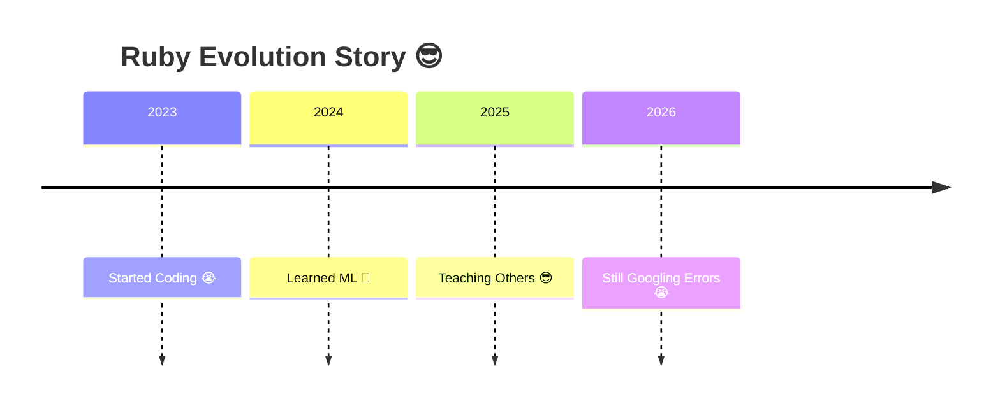


---

# 🎯 My Mission Statement

```
Goal:
- Crack Government Job 💼
- Become Data Scientist 🤖
- Learn Everything 🌍

Reality:
- Trying all at once 😭
```

---

# 🧠 Interview Preparation Mode

```
Interviewer: Explain Machine Learning

Me:
"Machine learning is when machine learns... and I also learn... and sometimes both get confused 😭"
```

---

# 🧑‍💻 Developer Starter Pack

* StackOverflow = God 🙏
* Google = Best Friend 💖
* Error = Daily Motivation 😭
* Coffee/Chai = Fuel ☕
* Sleep = Optional 😌

---

<p align="center">
  
  
  
  
  
</p>

---

# 👀 Visitor Counter 
<p align="center">
  
</p>

---

# 🎭 Final Meme Thought

```
Life is like coding:

If it works → don’t touch 😌  
If it breaks → pretend nothing happened 😭  
```

---


---


<p align="center">
  

</p>

```id="meme1"
When code runs perfectly:
Me: "I am future Elon Musk 😎🚀"

When error comes:
Me: "Bas bhai... government job hi theek hai 😭"
```

---


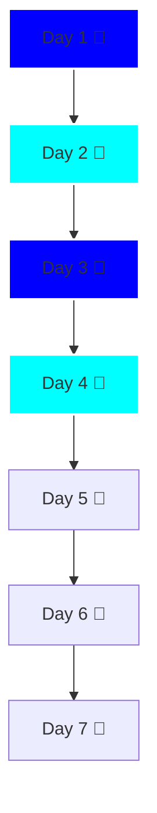


---


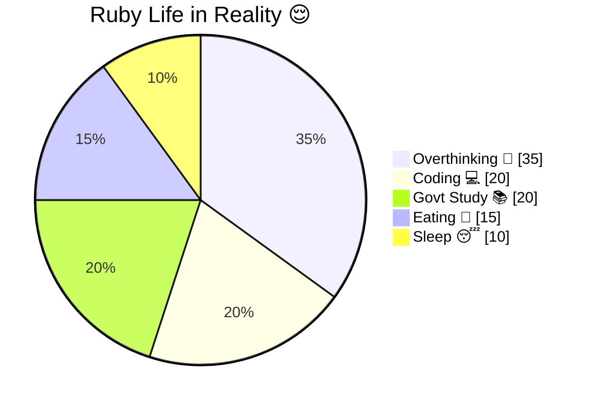

---


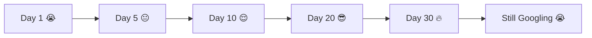

---


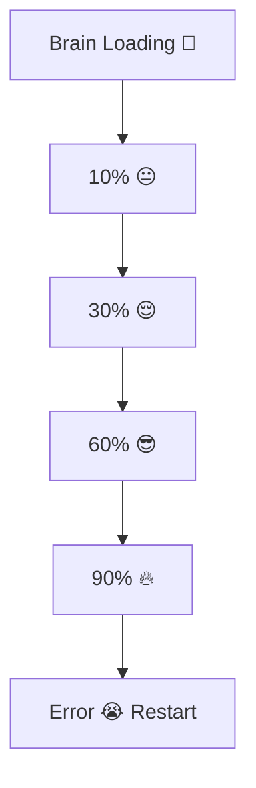

---


<p align="center">
  
</p>

```id="meme2"
Expectation:
"I will build AI system 🤖"

Reality:
Fixing one semicolon for 2 hours 😭
```

---


| Feature         | Status     |
| --------------- | ---------- |
| Coding Skill 💻 | ███████░░  |
| Govt Prep 📚    | █████░░░░  |
| Sleep 😴        | ██░░░░░░░  |
| Overthinking 🧠 | ██████████ |
| Motivation 🔥   | ████░░░░░  |

---


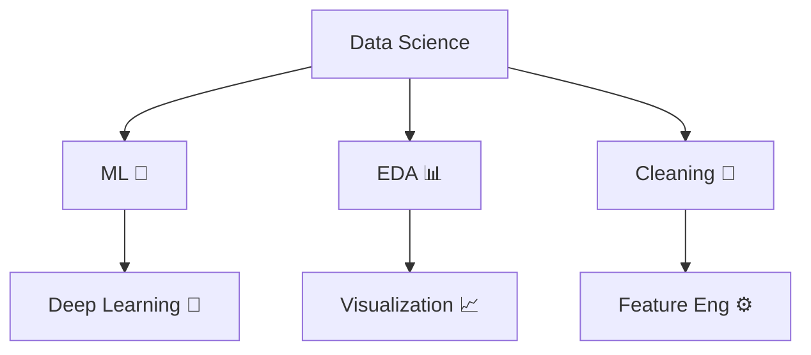

---


```id="studyfun"
Me: Today I will study 10 hours 😤

Also me:
- 1 hour planning
- 2 hour scrolling
- 3 hour thinking
- 0.5 hour studying
- 5 hour regret 😭
```

---


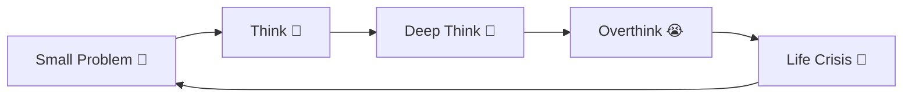

---


<p align="center">
  
</p>

```id="debuglife"
Life problem:
Try to fix 😌

More problems:
System crash 😭
```

---


```id="legendmeme"
I don’t make bugs…

I create unexpected features 😎✨
```

---


```
---
✨✨✨✨✨✨✨✨✨✨✨✨✨✨✨✨✨✨✨
---
```

---


```
✨ Welcome to My Chaotic Genius World ✨
```

---

```
🔥 I am not just learning…
I am exploring everything 🌍
```

---


